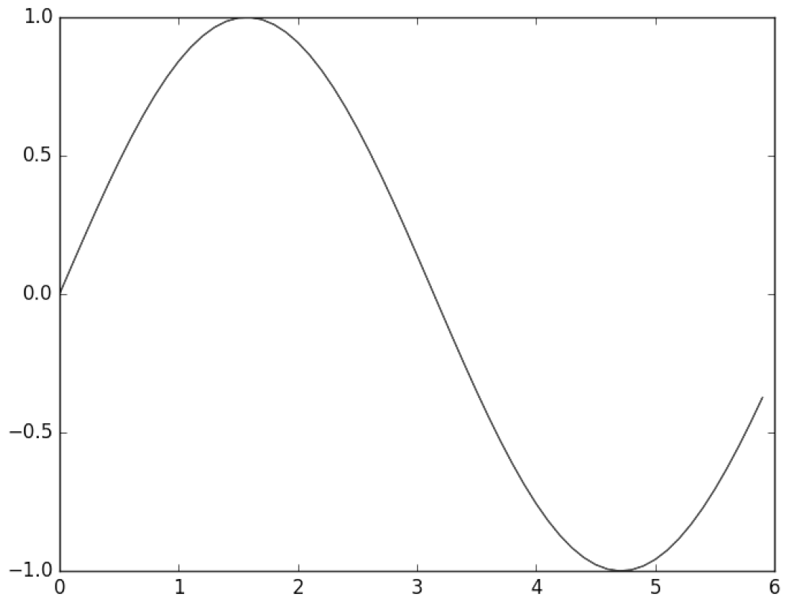
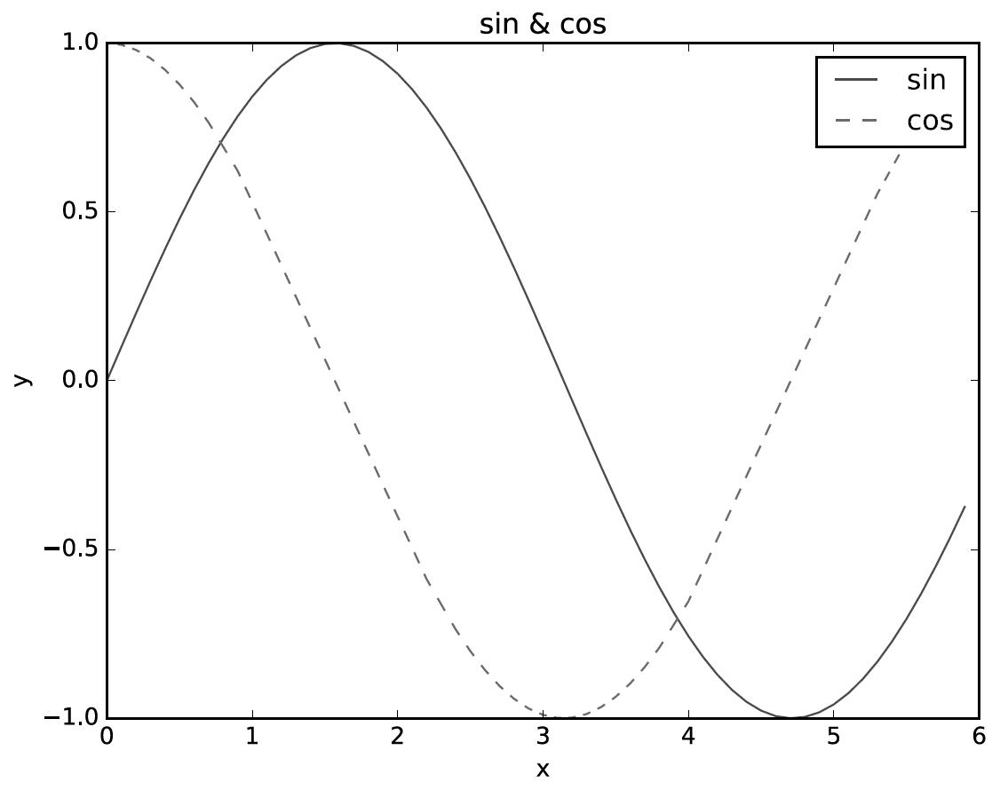
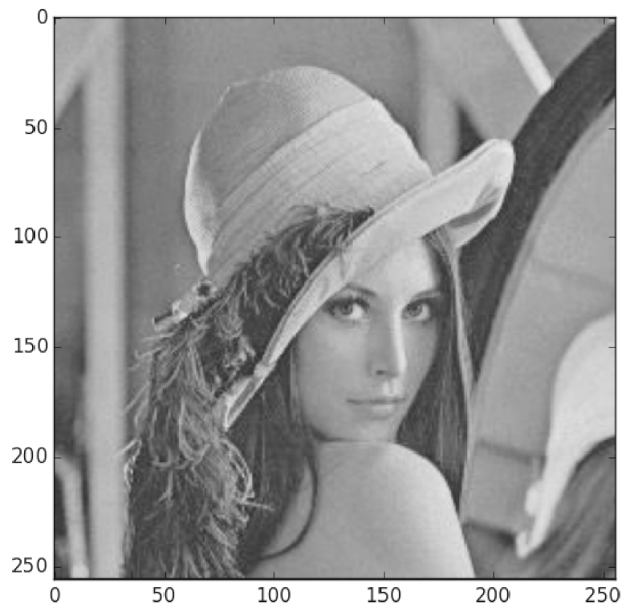

# chapter01. Hello, Python

## 1.1 Python이란?

- **간단하고** **배우기 쉬운** 언어입니다.

- Python 코드는 읽기 쉽고 성능이 우수합니다.

- `Tensorflow`, `NumPy`, `SciPy`와 같은 강력한 라이브러리를 지원하며 머신러닝 등 여러 분야에서 활용됩니다.

## 1.2 Python 설치하기

- Python 3.x 버전을 사용하며 [공식 홈페이지](https://www.python.org/)에서 받을 수 있습니다.

- 외부 라이브러리를 사용할 때엔 터미널을 사용해서 설치한 뒤 사용할 수 있습니다.

```bash
$ pip install <tensorflow, matplotlib, etc>
```

- Python에 `Anaconda`를 같이 사용하기도 합니다. [Anaconda](https://www.anaconda.com/)는 데이터 분석 등에 도움되는 라이브러리가 포함되어 있습니다.

## 1.3 Python interpreter

> 1.3_python_interpreter.py를 참고하면 됩니다.

## 1.4 Python script file

> 1.4_python_script.py를 참고하면 됩니다.

## 1.5 Numpy

> 1.5_python_numpy.py를 참고하면 됩니다.

### 1.5.5 Broadcast

- Numpy가 지원하는 기능 중 하나로 형상이 다른 배열끼리 계산할 수 있도록 만들어주는 기능입니다.


> 실제 어떻게 동작하는지 1.5_python_numpy.py에서 확인할 수 있습니다.

## 1.6 matplotlib

> 1.6_python_matplotlib.py를 참고하면 됩니다.

- 하단의 그래프는 해당 파일을 실행할 때 나오는 그래프들의 모습입니다.



> 1.6.1 단순한 그래프 그리기 예시입니다.



> 1.6.2 pyplot의 기능 예시입니다.



> 1.6.3 이미지 표시하기 예시입니다.

## 1.7 정리

- Python은 간단하고 익히기 쉬운 프로그래밍 언어로 오픈 소스이여서 자유로이 사용할 수 있습니다.

- Python은 interpreter와 script file로 동작할 수 있습니다.

- Python은 함수와 class를 사용해 구현을 정리할 수 있습니다.
