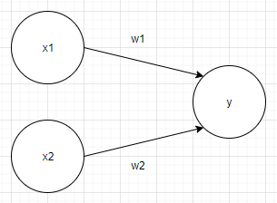
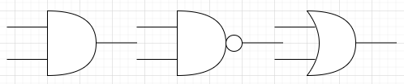
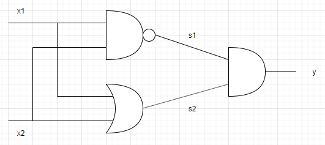

# chapter02. Perceptron

- Perceptron은 딥러닝의 기원이 되는 알고리즘입니다.

## 2.1 Perceptron이란?

- **Perceptron**은 다수의 신호를 입력받아 하나의 신호로 처리하는 `인공 뉴런`입니다.

- 하나의 Perceptron은 **node**로 불리며 이전 node에서 온 신호를 가지고 동작합니다.



- 위의 그림은 perceptron의 예로 x1과 x2는 입력 신호, y는 출력 신호, w1, w2는 각각의 가중치를 의미합니다.

- 입력 신호가 perceptron에 보내질 때 가중치가 곱해져 이들이 합쳐지는데 이 신호의 총합이 특정 한계를 넘어야 **1**을 출력합니다.

```python
import random

theta = random.randint(0, float('inf'))
x1, x2 = map(int, input().split())
w1, w2 = map(int, input().split())

y = x1 * w1 + x2 * w2
if y > theta:
    y = 1
else:
    y = 0
```

> 이와 같은 방식으로 동작합니다.

- Perceptron은 각 입력 신호에 고유 가중치를 부여하고 이 가중치에 따라 **서로 다른 결과**를 출력합니다.

## 2.2 단순한 논리 회로

### 2.2.1 AND

- **AND**는 입력된 두 신호가 모두 1일 때만 1을 출력하고 그 외에는 0을 출력합니다.

| x1 | x2 | y |
| :---: | :---: | :---: |
| 0 | 0 | 0 |
| 1 | 0 | 0 |
| 0 | 1 | 0 |
| 1 | 1 | 1 |

- AND 게이트로 perceptron이 동작하기 위해서 가중치와 임계값 설정이 중요합니다.

### 2.2.2 NAND, OR

- **NAND**는 AND의 출력 신호를 뒤집어 동작합니다. 즉, 모든 신호가 1이면 0을 출력합니다.

| x1 | x2 | y |
| :---: | :---: | :---: |
| 0 | 0 | 1 |
| 1 | 0 | 1 |
| 0 | 1 | 1 |
| 1 | 1 | 0 |

> NAND의 가중치와 임계값은 AND의 가중치와 임계값 부호를 반전하면 됩니다.

- **OR**은 두 출력 신호 중 하나라도 1이면 1을 출력합니다. 즉, 모든 신호가 0이어야 0을 출력합니다.

| x1 | x2 | y |
| :---: | :---: | :---: |
| 0 | 0 | 0 |
| 1 | 0 | 1 |
| 0 | 1 | 1 |
| 1 | 1 | 1 |

#### Note

- Perceptron의 매개변수는 인간이 **학습 데이터**를 보며 조정합니다.

- 여기에 머신러닝이 도입되면 매개변수 값을 스스로 결정합니다.

- 즉, 사람은 perceptron의 구조`model`를 고민하고 컴퓨터가 학습할 데이터를 제공하는 역할입니다.

## 2.4 Perceptron의 한계

### 2.4.1 XOR

- **XOR** 게이트는 **베타적 논리합**이라고 불립니다.

- 즉, 어느 한 쪽이 1일 때만 1을 출력하고 둘 다 0이거나 1이면 0을 출력합니다.

| x1 | x2 | y |
| :---: | :---: | :---: |
| 0 | 0 | 0 |
| 1 | 0 | 1 |
| 0 | 1 | 1 |
| 1 | 1 | 0 |

- 여기서 중요한 점은 XOR 게이트는 지금까지의 perceptron으로 구현할 수 없습니다.

    - OR 게이트는 가중치 매개변수가 존재할 때 OR 게이트를 2차원 그래프로 나타낼 수 있습니다.

    - 이 경우 가중치 직선이 하나 그어지는데 이 직선 아랫부분은 0을, 윗부분은 1을 나타냅니다.

    - 하지만 XOR 게이트는 0을 출력하는 부분과 1을 출력하는 부분이 엇갈려져 있습니다.

    - 따라서 XOR 게이트는 선을 그어 0과 1을 구분지을 수 없습니다.

### 2.4.2 선형과 비선형

- 위에서 언급한 XOR 게이트는 직선을 그었을 때 0과 1을 나눌 수 없습니다.

- 하지만 곡선으로 구분할 경우 이들을 0과 1로 나눌 수 있습니다. 이 경우를 **비선형**이라고 합니다.

> **선형**은 OR 게이트처럼 직선을 사용해 0과 1을 구분지을 수 있는 경우를 의미합니다.

## 2.5 다층 perceptron이 출동한다면

- XOR 게이트를 표현하기 위해서 perceptron을 쌓아올린 **다층 perceptron**이 필요합니다.

### 2.5.1 기존 게이트 조합하기



> 순서대로 **AND**, **NAND**, **OR** 게이트를 나타냅니다.

- XOR 게이트는 위의 3개의 게이트를 적절히 조합해야 구성할 수 있습니다.



> **XOR** 게이트

| x1 | x2 | s1 | s2 | y |
| :---: | :---: | :---: | :---: | :---: |
| 0 | 0 | 1 | 0 | 1 |
| 1 | 0 | 1 | 1 | 0 |
| 0 | 1 | 1 | 1 | 0 |
| 1 | 1 | 0 | 1 | 1 |

## 2.6 NAND에서 computer까지

- 다층 perceptron은 보다 복잡한 회로를 만들 수 있도록 도와주며 그 한계는 computer를 구현하는 것까지 가능합니다.

> computer는 NAND 게이트의 조합으로 구성되어 있습니다.
>
> 이론상 2층 perceptron(정확히 시그모이드 함수를 활성화 함수로 사용한 경우)을 사용하면 가능합니다.
>
> 다만 이 과정은 너무 어렵기 때문에 AND, OR 게이트를 만드는 것에서 시작해서 ALU, CPU까지 나아갑니다.

## 2.7 정리

- **perceptron**은 입출력을 갖춘 알고리즘으로 정해진 규칙에 따라 입력에 따른 값을 출력한다.

- perceptron은 **가중치**와 **편향**을 매개변수로 한다.

- perceptron으로 AND, NAND, OR 게이트 등을 표현할 수 있다.

- 단층 perceptron으로 XOR 게이트를 표현할 수 없으며 2층 perceptron은 가능하다.

- 단층 perceptron은 **선형 영역**을, 다층 perceptron은 **비선형 영역**을 표현할 수 있다.

#### 그럼 지금부터 perceptron에 대해 공부해봅시다!
