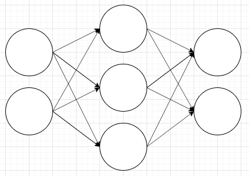
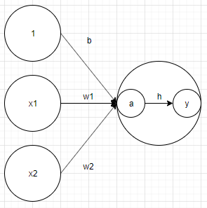

# chapter03. Neural Network

- Perceptron은 복잡한 함수를 표현할 수 있는 장점이 있지만 가중치를 사람이 일일히 설정해야 합니다.

- 하지만 이 과정을 **nueral network**, 즉 신경망을 사용해 해결할 수 있습니다.

## 3.1 Perceptron에서 neural network으로

### 3.1.1 Neural network의 예



- 위의 그림에서 좌측 줄을 **입력층**, 우측 줄을 **출력층**, 가운데를 **은닉층**이라고 부릅니다.

> 위의 그림은 신경망의 하나의 예시로 실제로 더 많은 층이 복잡하게 얽힌 경우가 많습니다.

### 3.1.2 Perceptron 복습

- Perceptron은 직전 노드에서 입력 받은 신호에 가중치를 곱한 값이 한계치를 넘을 경우 1을 출력하는 구조를 가지고 있습니다.

```python
import random

x1, x2 = random.randrange(0, 2), random.randrange(0, 2)
w1, w2 = random.random(), random.random()
b = random.random

y = b + x1 * w1 + x2 * w2
if y > 0:
    print(1)
else:
    print(0)
```

- 여기서 **b**, 즉 **편향 매개변수**는 해당 뉴런이 얼마나 쉽게 활성화 되는지를 제어합니다.

- 만일, 가중치가 `b`이고 입력이 `1`인 뉴런이 입력에 추가되면 **편향**이 추가된 값이 뉴런의 한계를 넘는지 확인해야 합니다.

- 이를 일반화하여 이전 뉴런에서 온 입력들의 합이 현재 뉴런에서 **활성화 함수**를 만나면 입력이 변환되어 그 값이 출력됩니다.

```python
import random


def h(x):
    if x > 0:
        return 1
    else:
        return 0


x1, x2 = random.randrange(0, 2), random.randrange(0, 2)
w1, w2 = random.random(), random.random()
b = random.random

y = h(b + x1 * w1 + x2 * w2)
print(y)
```

### 3.1.3 활성화 함수의 등장

- 앞서 등장한 활성화 함수는 **입력 신호의 총합을 출력 신호로 변환하는 함수**를 의미합니다.

- 즉, 활성화 함수는 **입력 신호의 총합이 뉴런의 활성화를 일으키는가**를 결정합니다.



- 위의 그림처럼 활성화 함수는 각 노드 안에서 직전 노드에서 들어온 신호의 합을 처리하고 출력을 제어합니다.

#### 주의사항

- 모든 딥러닝 알고리즘에 사용되는 노드를 모두 perceptron이라고 칭하면 엄밀히 틀립니다.

- **단순 perceptron**의 경우 단층 네트워크에서 계단함수(임계값을 경계로 출력이 바뀌는 함수)를 활성화 함수로 사용합니다.

- 반면에 **다층 perceptron**의 경우 여러 층으로 구성되고 시그모이드 함수 등을 활성화 함수로 사용하는 네트워크를 의미합니다.

## 3.2 활성화 함수

> 어떤 활성화 함수를 사용하는가에 따라 신경망 구성이 달라질 수 있습니다.

### 3.2.1 시그모이드 함수

- **시그모이드 함수**란 다음 함수를 의미합니다.

```
h(x) = 1 / (1 + exp(-x))
```

### 3.2.6 비선형 함수

- 특정 입력에 대한 출력 값이 입력의 배수만큼 변하는 함수를 **선형 함수**라고 합니다.

- 하지만 계단 함수, 시그모이드 함수 같이 선형이 아닌 모든 함수를 **비선형 함수**라고 합니다.

- 신경망은 비선형 함수를 활성 함수로 사용합니다.

    - 선형 함수는 아무리 함수를 중첩해도 결국 선형적인 결과 밖에 얻지 못합니다.

    ```
    y = h(h(h(x))) = c * c * c * x = c ** 3 * x = a * x
    ```

    - 반면에 비선형 함수는 다양한 값을 통해 신경망을 발달시킬 수 있습니다.

#### 그럼 지금부터 neural network에 대해 공부해봅시다!
